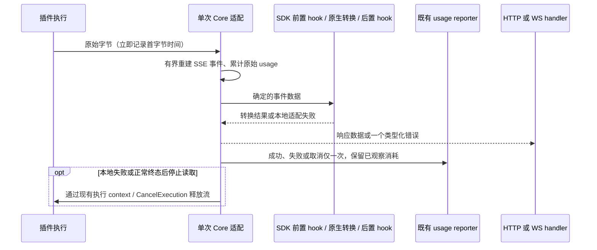

# Anthropic 插件的 Responses 适配

## 范围与兼容性

本功能服务于声明 `claude` 输出的任意执行器插件，不依赖具体供应商、账号或模型。标准 Anthropic message JSON 可转换为 Responses JSON；标准 SSE 字节流可转换为 Responses 事件。原生 Messages 直出、内置 ClaudeExecutor 的逐行/SSE 汇总路径和 Chat 插件保持原行为。

不重建协议中间层、不新增会话历史、不改变全局输出预算、账号选择或模型重试策略。公共 transformer 函数签名和 C ABI 不变。插件自行负责供应商参数、签名与提示词策略。

## 输出支持集

- 保留 text、thinking/signature、redacted_thinking、tool_use 的顺序、工具身份和参数。连续 signature_delta 按顺序拼接，流式与 SSE 汇总必须得到同一完整签名。现有 web_search server-tool 映射继续复用；其他承载内容的未知块不能静默丢弃。
- `end_turn`、`stop_sequence`、`tool_use` 表示本轮完成；`max_tokens` 表示 `incomplete/max_output_tokens`。未知、缺失或未支持的结束原因不伪装成完成。
- tool-only、thinking-only、合法空 content 不因没有可见文字被拒绝。
- SSE 支持 LF/CRLF/CR、完整帧/任意拆包、多 data 行、注释和 ping。data-only SSE 必须有标准空行事件分隔；内置执行器无分隔符的逐行调用保留原路径，不按网络块猜事件边界。
- 未知非内容事件允许忽略以保留协议扩展性；未知内容块、非法 JSON、未闭合内容块、无 message_stop 的 EOF 报错。截断的工具参数仅在已声明 max_tokens 时作为 incomplete 保留。
- 完成后重复终态与迟到事件不再次输出或发布 usage。事件与工具参数缓冲各限制为 50 MiB，沿用内置 Claude stream scanner 的量级，不降低其他路径上限。解析按行片段扫描，在复制片段前检查累计上限；超限不得依赖调用方 deadline 才终止。
- 插件 stream 的 response-before hook 接收每个已重建事件的一条 `data: <紧凑 JSON>`；after hook 接收现有转换器产生的 Responses 事件。hook 各执行一次，顺序不变；原生 Messages 和内置逐行调用的 hook 输入保持原样。

## 状态、统计和取消所有权

仅 claude→openai-response 插件路径调整观察和发布顺序。原始 usage 与客户端编码职责分离，不从译后结果倒推供应商消耗。首字节时间基于原始到达，语义计时基于完整事件。转换后的成功必须晚于本地适配结果确定。错误清理产生的取消不能覆盖最初错误或再发布一条记录。

本地解析/转换错误使用现有 request-scoped 语义，HTTP 状态仍可为 502；不换号、不冷却凭据、不再次调用模型。真正上游错误保留原有分类。适配层通过现有 Err 通道报告，handler 独占线上错误封装；客户端已断开时只要求内部资源收口，不保证错误事件可送达。

即使首个 payload 被流拦截器丢弃、尚未提交给客户端，handler 的 bootstrap retry 也必须尊重（含 wrapped error 的）RequestScopedError。该判断只阻止请求级错误，其他状态码重试规则不变。

## WebSocket 历史边界

复用 handler 现有 lastRequest/lastResponseID，不在插件保存历史。HTTP/SSE 上游的 WS 续接若显式携带 previous_response_id，必须匹配当前连接最后成功响应（或既有本地 prewarm ID）；未知或其他连接的父响应应在模型 dispatch 前拒绝，且不得破坏已接受历史。原生 WS passthrough 仍由其上游判断，不改变该路径。

## 请求侧独立纠错

Responses 字符串 input 与等价 user 数组输入语义一致。显式 temperature/top_p 保留，tool_choice=none 明确禁止工具，parallel_tool_calls=false 对有工具的请求映射为 disable_parallel_tool_use。不改变未指定参数的默认值，不用这些映射承诺所有兼容模型都支持该参数。

## 插件模型的显式兼容模式

插件 ModelInfo 新增可选 `IsCompat`，默认 false。仅选中账号实际注册的模型（无账号时当前插件静态模型）可以启用；不能按客户端 body 标志或同名外部模型启用。该字段复用现有第三方 Anthropic thinking/signature 兼容转换规则，request normalizer 仍在原生转换后生效。不会恢复被 normalizer 删除的内容，不修改普通 Claude 签名校验，也不代表跨供应商 reasoning 可移植。

这是可选 JSON 字段，不改变 C ABI/schema 版本。旧插件省略它维持原行为；新插件不能把旧宿主忽略字段视为能力已生效，必须声明最低支持版本并验证。

## 请求级禁止重定向

插件 HTTPRequest 新增 `DisableRedirects`（JSON `disable_redirects`），默认 false；普通与 wire-profile HTTP 路径均支持。true 时使用 `http.ErrUseLastResponse` 返回第一份 3xx，不向 Location 再发请求，也不改变原请求的代理/TLS策略。插件必须对握手及模型请求显式启用并处理 3xx。

旧插件不受默认值变化影响。该选项不自动禁日志；凭据端点继续使用既有 SensitiveEndpoints 声明。

注册与重配置请求新增可选 `host_features` 字符串列表，声明 `anthropic-plugin-responses-v1`、`plugin-model-compat-v1`、`http-disable-redirects-v1`、`sensitive-endpoints-v1`。这是当前实现的静态声明，不增加协商请求、配置、状态或 schema 版本。旧插件可忽略，新插件依赖其中某项时必须在读取秘密/出网前校验，缺少即拒绝；不能以相同 schema 数字或人工确认代替安全能力检查。

## 验收

1. JSON text、thinking、tool-only、混合块、缓存 usage、max_tokens；旧 SSE 汇总回归。
2. SSE 完整/多 data/逐字节/固定种子拆包结果一致，UTF-8/CRLF/CR、超限、截断、重复终态、上游错误和主动失败均覆盖。
3. 实际 Responses handler + 中性合成插件，JSON/SSE 与两个可用账号失败场景；执行次数为一，usage 一次归属，账号可用状态不变。
4. 原生 Messages、内置 ClaudeExecutor、Chat 插件保持可用；前后置转换 hook 不重复或被绕开。
5. 模型 compat 开关只影响选中模型，opaque thinking 保留且正常模式仍拒绝不兼容内容。
6. HTTPDo/HTTPDoStream 的 307/308 合成转发目标不得收到请求；默认未启用时保持历史重定向行为。
7. 定向单测、race/vet、usage/Management 契约、LTS guard、全仓测试和服务端构建记录真实结果，不把未执行视为通过。

部署、真实供应商 UAT、计费、全协议支持和插件自身 prompt 功能不属于本 Core 特性的验证声明。

## 开发验证记录

基线 `b809d748`，分支 `feat/anthropic-plugin-responses`；Go 1.27.0、macOS arm64。全部依赖解析使用 GOPROXY=off/GOSUMDB=off；供应商请求只使用内存替身或 loopback 合成服务，无真实凭据。

- 新 JSON/请求控制、完整 SSE 与多行 usage、redirect、选中模型 compat、丢弃首包后的 request-scoped 重试、分片 thinking 签名和 WS 错误父响应测试均在实现前实际失败，随后通过。
- 最终回归包含静态 host_features；消费者动态集成进一步验证 HTTP JSON/SSE、有效 header 控制、工具/thinking 两轮、WS 同连接续接及错误父 ID 不 dispatch。未把消费者源码或测试放入 Core，也未执行真实供应商请求。
- `go test -count=1 -p=1 -timeout=180s ./...`：通过，包含 usage、Management、内置执行器、handler、translator、动态 CodeBuddy 集成。
- `go test -race -count=1 -timeout=180s ./internal/pluginhost ./internal/translator/claude/openai/responses ./sdk/translator ./sdk/api/handlers`：通过；WS 父响应校验回归单独 race 通过，整个 openai handler 包普通回归通过。
- `go vet ./internal/pluginhost ./internal/translator/claude/openai/responses ./sdk/pluginapi ./sdk/translator ./sdk/api/handlers`：通过。
- Qoder 与 CodeBuddy 嵌套 module 的 `go test -count=1 ./...`：分别通过。
- `scripts/check-lts-contract.sh`、`git diff --check`、修改文件 gofmt 检查和 `go build ./cmd/server`：通过；构建输出置于独立临时目录。
- 额外以既有消费者动态库跑合成 Responses HTTP 集成：字符串 input、非流式数组、流式数组均返回正确答案；JSON/SSE 汇总及内置执行器对照通过。该离线消费者不是特性依赖，不证明其供应商控制或生产安全已完成。

PR 首轮 Linux/Go 1.26 race 检查中，50 MiB 超限用例超过既有 3 秒调用方 deadline；没有报告数据竞态。分帧改为按行片段扫描、复制前检查上限后，本地原用例 `-race -count=20` 和 CI 同组八包 race 均通过，动态消费者全链回归通过。未修改测试期限或降低事件上限。

一次并行全仓运行中，`TestCodeBuddyDynamicPlugin` 在输出卸载日志后达到其 90 秒子进程上限；此前全仓通过，随后隔离连续两次通过、最终串行全仓通过。没有修改该测试或以增加超时掩盖；此偶发失败根因未确认。

### Protected delta review

- 保留原 reporter、auth index、provider/model、usage provenance 和统计存储/导出结构；只在新 Anthropic 插件适配路径延后最终发布。
- 账号路由与普通上游错误重试保持原逻辑；handler 补齐已有 request-scoped 契约，不重新定义错误策略。
- C ABI/schema 不变；IsCompat、disable_redirects 是默认关闭的可选字段，host_features 为静态声明，旧插件无需修改。无供应商特判、全局输出预算变化、新增 WS 状态或持久状态；WS 修正只校验已有最后成功响应 ID。
- 动态库 loader/drain 不改动；卸载仍须等待在途 RPC，不能把新增 stream 取消覆盖误当成强制热卸载保证。
- 回退可撤销该特性变更；依赖新可选字段的插件必须相应停止使用，不得继续声称旧宿主提供相同保证。
