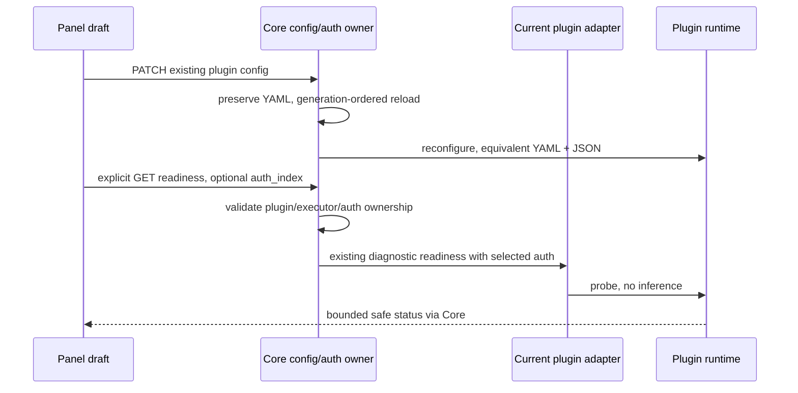

# Plugin management readiness contract

## Scope

Management clients must distinguish auth parsing/import from interactive OAuth, and plugin registration from actual execution readiness. Reuse ProviderReadiness, selected credential enrichment and existing config persistence; do not create a second runtime, account store or poller.

## Additive contracts

- Capabilities.AuthImportOnly / RPC auth_import_only defaults false. True retains auth parse/refresh but disables login start/poll and reports supports_oauth=false. Existing plugins remain unchanged.
- GET /v0/management/plugins additionally exposes supports_auth, auth_provider, supports_readiness and executor_provider per registered plugin. Missing fields mean unsupported to old/new clients alike.
- GET /v0/management/plugins/:id/readiness?auth_index=... is management-authenticated. Plugin must be current, enabled and own the selected executor. Optional credential is resolved by Core, must match provider, and is never accepted as raw JSON from the browser. Missing/foreign credentials are rejected before invoking the plugin. Probe uses Purpose=diagnostic and a bounded context, no model call or quota query. Response is the existing ReadinessResponse; plugin errors return a fixed safe message, no arbitrary errors/credential details.
- Registration/reconfigure additionally carries config_json, a base64 JSON representation of the same config_yaml subtree. Core owns parsing, plugins may choose either representation; no second saved config. If YAML cannot be represented exactly as a JSON object, omit config_json while preserving the original config_yaml for legacy plugins. JSON-dependent plugins must reject an absent projection; never silently drop fields or reject a previously valid legacy YAML configuration at the host boundary.
- host_features adds plugin-management-v1 covering these capabilities. ABI/schema unchanged. Old plugins may ignore it; dependent new plugins reject missing capability before secrets/network.

## Ownership and event order

Readiness is a snapshot, not a liveness subscription or remote service acceptance. Existing unload/drain semantics remain unchanged. Requests from stale Panel connections must not update the current view.

## Acceptance

Manual-only registration does not advertise/execute OAuth; legacy registration remains compatible. Config JSON roundtrips booleans, arrays, objects and strings without custom YAML parsers. Ready/not-ready/unsupported, wrong plugin/auth, missing host, timeout/error safety and no inference calls are covered. Consumer integration proves inline single-file credentials and upstream/model overrides reach the effective request. Panel shows registration separately from readiness, never infers ready from HTTP200 alone.
